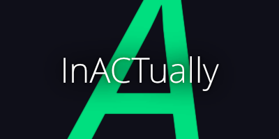

# InACTually Stage
a spatial Interface for orchestrating Media in \
interactive theater for actual acts


InACTually is (or wants to be) an artistic tool and consists of the Stage and the Stage. InACTually allows artists to realize their multimedia and multimodal concepts autonomously. The underlying spatiality of performing arts is used to design an intuitive and easy-to-use interface, which introduces direct manipulation as well as immersive applications in Mixed Reality.

<br>

## 🎢 What InACTually actually is
... or what it wants to be.
We should definitively path this out.

InACTually started 2021 as tiny tool made by Lars Engeln and Fabian Töpfer that suits their needs to create spatial media installations and interactive moments in theater productions. So it got bigger and bigger over time, sometimes without really any time to refurbish. Thereby, some parts might be a bit deprecated, but we are tidying up :)

[The Engine](https://github.com/InACTually/InACTually-Engine) (in another repo) is InACTually's autonomous media server, using RoomNodes for spatial elements and ProcessingNodes to control complex behavior via a node-link system.

The Stage is InACTually's frontend, that should be more intuitive to use and should only give instructions to the Engine what to do. The core idea of the Stage is to serve as a spatial interface for designing interactive performances. This interface allows devices to be positioned, configured, and monitored within a spatial context. At its heart are **Actionspaces** —interactive subareas where artistic interactions unfold. Technical complexity is reduced through high-level presets that simplify detailed configurations. The Stage is meant to be hosted in a venue, to easily access it via a tablet or a Mixed-Reality headset.

<br>

## 🎭 Gallery

We would like to build up a Gallery to showcase how InACTually is been used in all the lovely projects. Please contact us, if you use InACTually (all tools or one of them) in your projects.
And think about to contribute to the Gallery. \
Some impressions from projects by Fabian Töpfer and Lars Engeln using InACTually:


<br>

## 🛠️ Setup

Make sure to install the dependencies:

```bash
 
# yarn
yarn install
 
```

### Development Server
```bash

# nuxt only
yarn devs

# nuxt and electron in parallel
yarn dev:electron

```

### Build

see buildConfig.js for platform settings

```bash

# nuxt (static) and electron 
yarn build:electron

```

executables in .output/electron-dist

<br>

## ✒️ Contributing
Whether you are fixing a bug, suggesting an improvement, or just asking a question, you are helping make this better. Best is always to contact us, but you find more information in the [CONTRIBUTING.md](CONTRIBUTING.md).

<br>

## 🧩 Third-Party Notice and Credits

The InACTually Engine project uses external resources licensed under open-source terms. \
You can find the list of frameworks, code snippets, models, and other material in the [THIRD_PARTY.md](THIRD_PARTY.md).

<br>

## 📜 License
The InACTually Engine is licensed under the MIT License, see the [LICENSE](LICENSE). \
Contact us, if you use InACTually (all tools or one of them) in your projects. 
Would be nice to see, what lovely things you are creating :)
